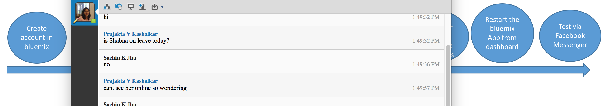

# watson-conversation-facebook-messenger-sample

This application demonstrates how a Facebook messenger server application can use Watson Conversation service to get the response to user based on user input and context.

For more information about Conversation, see the [detailed documentation](http://www.ibm.com/watson/developercloud/doc/conversation/overview.shtml).

For more information on Set up Facebook messenger and webhooks refer to the [documentation](https://developers.facebook.com/docs/messenger-platform/quickstart)  

<b>To deploy this application you must have a Facebook account, a facebook messenger app, a Bluemix account and run some steps within Bluemix.</b>

&nbsp;&nbsp;&nbsp;&nbsp;&nbsp;&nbsp;&nbsp;&nbsp;&nbsp;&nbsp;&nbsp;&nbsp;&nbsp;&nbsp;&nbsp;&nbsp;&nbsp;&nbsp;&nbsp;&nbsp;&nbsp;&nbsp;&nbsp;&nbsp;&nbsp;&nbsp;&nbsp;&nbsp;&nbsp;&nbsp;&nbsp;&nbsp;&nbsp;&nbsp;&nbsp;&nbsp;[](#bluemix)     &nbsp;&nbsp;&nbsp;&nbsp;&nbsp;&nbsp;&nbsp;&nbsp;&nbsp;&nbsp;&nbsp;&nbsp;&nbsp;&nbsp;&nbsp;&nbsp;&nbsp;&nbsp;&nbsp;&nbsp;&nbsp;&nbsp;&nbsp;&nbsp;[](#local)

## How the app works
Once the app is deployed and Facebook messenger server application configured and webhook registered, you can go to Facebook messenger and search for the bot using the name that you used to register your application.Following is the sequence of events after that.

    you send message from messenger window to your chat bot
    the webhook api endpoint in the deployed app receives the request with message details 
    It handles the request, invokes the conversation API and stores the context in memcached cache.
    It sends response to the messenger client based on conversation API response.
    
  
The conversation service is desiged to act as a share trading assistant. You can start the conversation with messages like 

    I want to buy shares
    I want to sell shares
    I want to buy shares of IBM

This sample is not a guide on conversation service. For that refer to other samples. The intent of this sample is to show how to integrate facebook messenger app with conversation service and how to maintain context between the api calls.

<a name="bluemix">
# Getting Started using Bluemix
</a>



## Before you begin
1 Ensure that you have a [Bluemix account](https://console.ng.bluemix.net/registration/).

2 Ensure that you have the necessary space available in your Bluemix account. This action deploys 1 application and 1 service.
   * You can view this on your Bluemix Dashboard. Tiles will show what space you have available.
   * For example, for Services & APIS

    &nbsp;&nbsp;&nbsp;&nbsp;&nbsp;&nbsp;&nbsp;&nbsp;&nbsp;&nbsp;&nbsp;&nbsp;

## Deploy the App
1 Select Deploy to Bluemix.

&nbsp;&nbsp;&nbsp;&nbsp;&nbsp;&nbsp;&nbsp;&nbsp;&nbsp;&nbsp;&nbsp;&nbsp; [](https://bluemix.net/deploy?repository=https://github.com/sachinjha/watson-conversation-facebook-messenger-sample)

2 Log in with an existing Bluemix account or sign up.

3 Name your app and select your REGION, ORGINIZATION, and SPACE. Then select DEPLOY.
&nbsp;&nbsp;&nbsp;&nbsp;&nbsp;&nbsp;&nbsp;&nbsp;&nbsp;&nbsp;&nbsp;&nbsp; 

* This performs two actions:
  - Creates the app
  - Creates a Conversation service instance that the user needs for workspace creation
  - Creates a memcached service instance which is used for storing conversation context or metadata.

* The status of the deployment is shown. This can take some time.

&nbsp;&nbsp;&nbsp;&nbsp;&nbsp;&nbsp;&nbsp;&nbsp;&nbsp;&nbsp;&nbsp;&nbsp;

4 Once your app has deployed, select VIEW YOUR APP.

&nbsp;&nbsp;&nbsp;&nbsp;&nbsp;&nbsp;&nbsp;&nbsp;&nbsp;&nbsp;&nbsp;&nbsp;

5. If your application name is "mymessengerapp" and domain is "mybluemix.net" then your
application route will be "mymessengerapp.mybluemix.net" and <a name="applicationURL">application URL</a> would be https://mymessengerapp.mybluemix.net

<a name="workspace">
## Import a workspace
</a>

To use the app you're creating, you need to add a worksapce to your Conversation service. A workspace is a container for all the artifacts that define the behavior of your service (ie: intents, entities and chat flows). For this sample app, a workspace is provided.

For more information on workspaces, see the full  [Conversation service  documentation](https://www.ibm.com/smarterplanet/us/en/ibmwatson/developercloud/doc/conversation/overview.shtml).

1 Navigate to the Bluemix dashboard, select the Conversation service that you created.

2 Go to the **Manage** menu item and select **Launch Tool**. This opens a new tab in your browser, where you are prompted to login if you have not done so before. Use your Bluemix credentials.

3 If you are deploying through Bluemix, download the [exported JSON file](https://raw.githubusercontent.com/watson-developer-cloud/conversation-simple/master/training/car_workspace.json) that contains the Workspace contents. If deploying locally,  this was cloned and is in the training folder (training/car_workspace.json).

4 Select the import icon: . Browse to (or drag and drop) the JSON file. Choose to import **Everything(Intents, Entities, and Dialog)**. Then select **Import** to finish importing the workspace.

5 Refresh your browser. A new workspace tile is created within the tooling. Select the _menu_ button within the workspace tile, then select **View details**:

&nbsp;&nbsp;&nbsp;&nbsp;&nbsp;&nbsp;&nbsp;&nbsp;&nbsp;&nbsp;&nbsp;&nbsp;

<a name="workspaceID">
In the Details UI, copy the 36 character UNID **ID** field. This is the **Workspace ID**.
</a>

&nbsp;&nbsp;&nbsp;&nbsp;&nbsp;&nbsp;&nbsp;&nbsp;&nbsp;&nbsp;&nbsp;&nbsp; 


## Update config values with service credentials and conversation workspaceId


* Update Following fields in  <PROJECT_ROOT>/config/default.json 
      - workspace_id  with workspace_id copied [above](#workspaceId)
      - serverURL : Set the value to https://<DEPLOYED_APPLICATION_ROUTE>   
      - <a name="validationToken">validationToken</a> : Set the value to some secret string which and use the same during [Facebook app Registration](#facebook) step related to Webhook validation token. e.g. "my_secret_validation_token"
      - 
* Update the service credentials in respective files. Go [here](#credentials) to learn how to view the credentials.
      - cache.js with memcached_service credentials
      - conversation.js with conversation_service credentials.

<a name="usingCloudfoundry">
## Redeploy the APP using  Cloudfoundry CLI tool 
</a>

To build the application:

1 Download and install the [Cloudfoundry CLI](https://github.com/cloudfoundry/cli) tool.

2 Git clone the project `https://github.com/sachinjha/watson-conversation-facebook-messenger-sample`

3 Navigate to the `watson-conversation-facebook-messenger-sample` folder

4 

4 Connect to Bluemix in the command-line tool:

 For US Region

 ```sh

 $ cf api https://api.ng.bluemix.net

 ```

 ```sh

 $ cf login -u <your user ID>

 ```


5 Push it live:

 ```sh

 $ cf push <application-name>

 ```
 


<a name="credentials">
# Service Credentials
</a>

1 Go to the Bluemix Dashboard and select the application instance instance. Once there, Go to the **Connections** menu and then click on the **Service Credentials** menu item for the service whose credentials you want to read.

&nbsp;&nbsp;&nbsp;&nbsp;&nbsp;&nbsp;&nbsp;&nbsp;&nbsp;&nbsp;&nbsp;&nbsp;


2 Copy the credentials (or remember this location) for later use.

<a name="facebook">
## Facebook messenger app registration 
</a>

Follow the steps described [here](https://developers.facebook.com/docs/messenger-platform/quickstart) 
* Copy the <a name="appsecret"> facebook app secret</a> generated in Step 1. Create a Facebook App and Page 
* In step 2. Setup webhook , 
    - set the url to [YOUR_APPLICATION_ROUTE](#applicationURL)/webhook 
    - set verify Token to validation token value chosen [above](#validationToken).
* Copy the <a name="pageAccessToken">page access Token </a> generated in Step 3. Get page access token.

## Update config values and redeploy app

* Update following fields in config/default.json
    - set appSecret with value copied [here](#appsecret)
    - set pageAccessToken with value copied [above](#pageAccessToken)
  

## Redeploy the app following the steps described [earlier](#usingCloudfoundry)

## Testing the integration 
* Login to Facebook Messenger and search the bot with the name used during [Facebook Messenger app registration](#facebook)
* Type in statements like these to get the conversation started
    - I want to buy shares
    - I want to sell shares
    

## Plugging the bot to different conversation workspace.  
* Just update the workspace_id in config/default.json 
* Redeploy app
* If workspace is under a different service instance then one also needs to update the service credentials in conversation.js

# Troubleshooting in Bluemix

#### In the Classic Experience:
- Log in to Bluemix, you'll be taken to the dashboard.
- Navigate to the the application you previously created.
- Select **Logs**.

&nbsp;&nbsp;&nbsp;&nbsp;&nbsp;&nbsp;&nbsp;&nbsp;&nbsp;&nbsp;&nbsp;&nbsp;

- If you want, filter the LOG TYPE by "APP".

&nbsp;&nbsp;&nbsp;&nbsp;&nbsp;&nbsp;&nbsp;&nbsp;&nbsp;&nbsp;&nbsp;&nbsp;

#### In the new Bluemix:
- Log in to Bluemix, you'll be taken to the dashboard.
- Select **Compute**

&nbsp;&nbsp;&nbsp;&nbsp;&nbsp;&nbsp;&nbsp;&nbsp;&nbsp;&nbsp;&nbsp;&nbsp;

- Select the application you previously created.
- Select **Logs**.

&nbsp;&nbsp;&nbsp;&nbsp;&nbsp;&nbsp;&nbsp;&nbsp;&nbsp;&nbsp;&nbsp;&nbsp;

- If you want, filter the Log Type by selecting the drop-down and selecting **Application(APP)**.

&nbsp;&nbsp;&nbsp;&nbsp;&nbsp;&nbsp;&nbsp;&nbsp;&nbsp;&nbsp;&nbsp;&nbsp;

# Troubleshooting with CLI

To see the logs, run the command

`$ cf logs < application-name > --recent`

# License

  This sample code is licensed under Apache 2.0.
  Full license text is available in [LICENSE](LICENSE).

# Contributing

  See [CONTRIBUTING](CONTRIBUTING.md).


## Open Source @ IBM

  Find more open source projects on the
  [IBM Github Page](http://ibm.github.io/).

